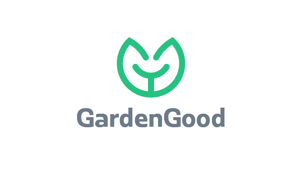
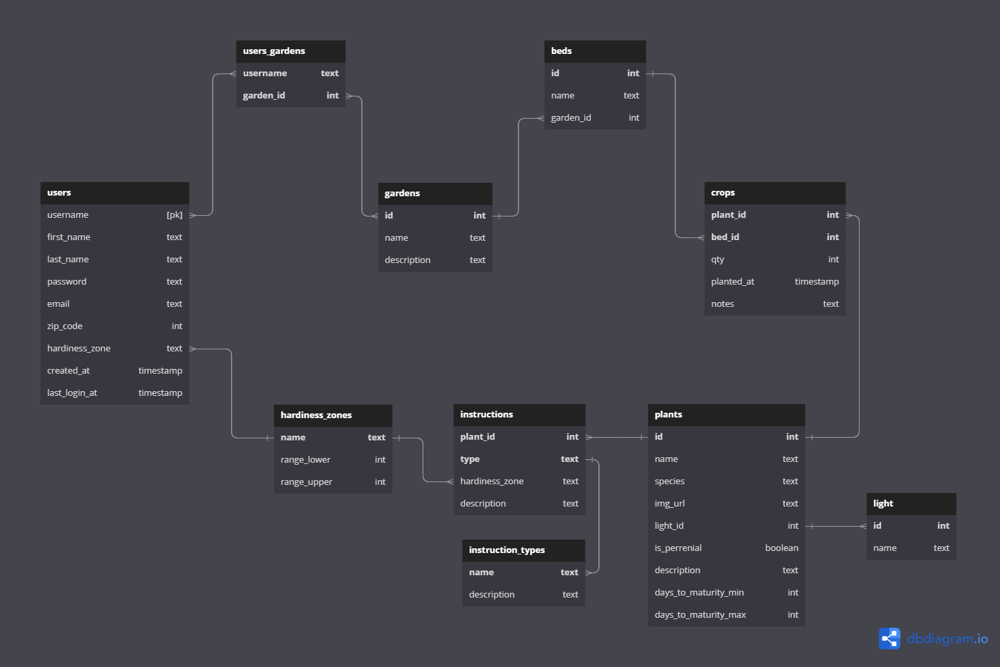

<!-- a. The title of your site and a link to the URL where it is deployed -->

# **GardenGood App**

_Helping gardeners plan, plant, and tend their crops for a thriving garden._



<!-- b. Describe what your website does -->

The Garden Good app helps beginning gardeners and experienced gardeners plan, plant, and tend their crops for an abudant harvest. This app incorporates weather alerts to help you protect your garden from harsh conditions, and allow it to thrive. From proper feeding and watering to pruning and pests, this app will help you garden GOOD.

I created the simplest form of this application during my time in Springboard's Software Engineering Bootcamp, but it is an ongoing project with more features planned. This first iteration allows users to search for plants and find information on how to take care of the plants in their garden. When a user signs up or logs in, the current weather conditions for their zip code is displayed in the top of the app. The users also have the ability to update their account information.

Live link: https://gardengood.surge.sh/

---

<!-- c. List the features you implemented and explain why you chose those features to implement -->
<!-- d. Where your tests are and how to run them -->
<!-- e. Walk someone through the standard user flow for the website -->

## Standard User FLow

<!-- f. Keep the API in there, and if you have anything to say about the API then add some notes. If you have created your own API, please document the process. -->

---

## Weather API

https://www.weatherapi.com/

---

<!-- g. Identify the technology stack used to create your website -->

## Technology Stack

---

<!-- h. Include anything else that you feel is important to share -->

## Cloning this Project

### **Cloning Submodules**

This repo uses submodules. In order for submodule folder content to be included in the clone, use the following command:

```
git clone --recurse-submodules https://github.com/MattBaltzell/garden-good.git
```

### **Install Backend Dependencies**

Navigate to 'gardengood-backend' directory.

Install all required dependencies with command: `npm install` or `npm i`

### **Create GardenGood Database**

While in the 'gardengood-backend' root directory, run the following command and follow the prompts to create and initialize the database: `psql < gardengood.sql`

### **Start the Backend App**

While in the 'gardengood-backend' root directory, run the command `npm run dev` or `npm run start`.  
This command will start a backend server under port `3001`.

### **Install Fontend Dependencies**

Navigate to 'gardengood-frontend' directory.  
Install all required dependencies with command: `npm install` or `npm i`

### **Start the Frontend App**

While in the 'gardengood-frontend' root directory, run the command `npm start`.  
This command will open the application front-end in development mode under port `3000`.

Open http://localhost:3000 to view application in your browser.

---

## Database Schema


