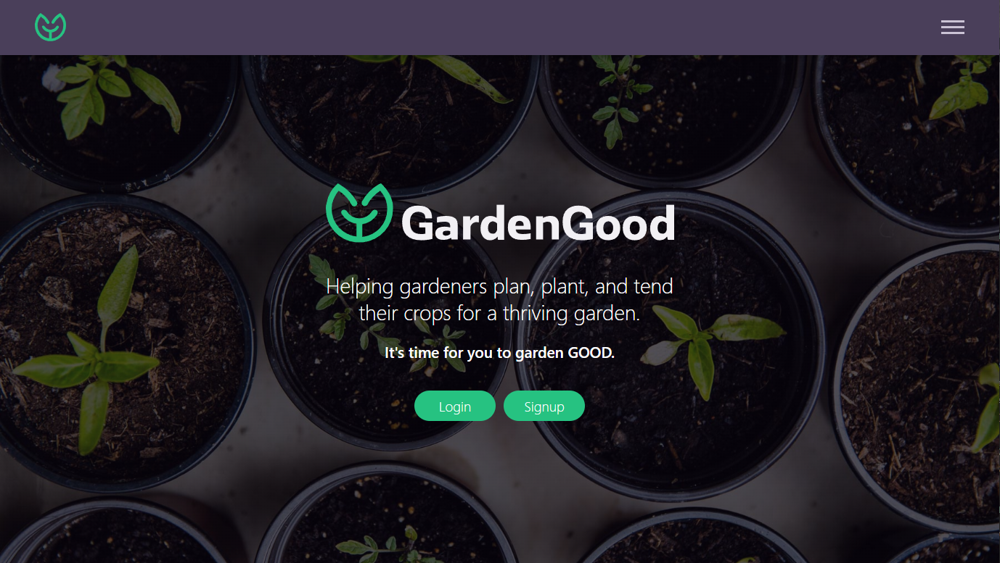

# **GardenGood App**

_Helping gardeners plan, plant, and tend their crops for a thriving garden._



The Garden Good app helps beginner and experienced gardeners plan, plant, and tend their crops for an abudant harvest. This app incorporates weather alerts to help you protect your garden from harsh conditions, and allow it to thrive. From proper feeding and watering to pruning, this app will help you garden GOOD.

I created the simplest form of this application during my time in Springboard's Software Engineering Bootcamp, but it is an ongoing project with more features planned. This first iteration allows users to search for plants and find information on how to take care of the plants in their garden. When a user signs up or logs in, the current weather conditions for their zip code is displayed in the top of the app. The users also have the ability to update their account information.

Live link: https://gardengood.surge.sh/

---

## Features

### Plant Directory

The backbone of this app is the plant directory. Users can find information on the plants they want to grow in their garden.

### Current Weather

Weather conditions are important for gardeners to properly care for their crops. So at all times, the current weather is displayed for the user to determine if the plants need extra attention based on weather conditions.

### Coming Soon: My Gardens

Expanding on the Plant Directory, this feature allows users to group and organize crops within multiple beds and gardens. This grouping allows users to digitally map out their actual gardens, and from these groups, the users can quickly find information on the plants that they are growing.

---

## Standard User Flow

1. A user logs into the app and lands on the home page where the current weather for the user's location is displayed.
2. After navigating to the 'Plants' page, where there is a large grid of plants.
3. The user can type into the search bar to filter plants by name.
4. When the user clicks their desired plant, plant care information is displayed.

---

## Weather API

The Weather API uses a user's zip code to provide current weather data to the user upon login.  
https://www.weatherapi.com/

---

## Technology Stack

This app was built in the PERN Stack.

- PostgreSQL
- Express
- React
- Node

The app was styled with vanilla CSS with a mobile-first responsive design approach. No UI frameworks were used.

---

## Cloning this Project

### **Cloning Submodules**

This repo uses submodules. In order for submodule folder content to be included in the clone, use the following command:

```
git clone --recurse-submodules https://github.com/MattBaltzell/garden-good.git
```

### **Install Backend Dependencies**

Navigate to 'gardengood-backend' directory.

Install all required dependencies with command: `npm install` or `npm i`

### **Create GardenGood Database**

While in the 'gardengood-backend' root directory, run the following command and follow the prompts to create and initialize the database: `psql < gardengood.sql`

### **Start the Backend App**

While in the 'gardengood-backend' root directory, run the command `npm run dev` or `npm run start`.  
This command will start a backend server under port `3001`.

### **Install Fontend Dependencies**

Navigate to 'gardengood-frontend' directory.  
Install all required dependencies with command: `npm install` or `npm i`

### **Start the Frontend App**

While in the 'gardengood-frontend' root directory, run the command `npm start`.  
This command will open the application front-end in development mode under port `3000`.

Open http://localhost:3000 to view application in your browser.
